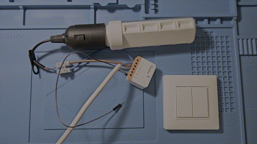
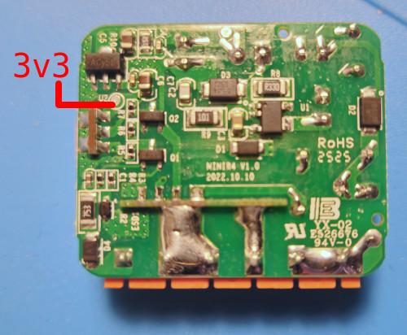
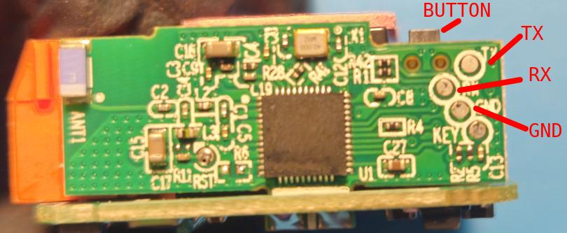

Overview
========



This is a replacement firmware for the ESP32 powering
[Sonoff's MINIR4](https://sonoff.tech/en-it/products/sonoff-mini-extreme-wi-fi-smart-switch-minir4)
that enables it to directly respond to actions from
[Enocean's PTM216B](https://www.enocean.com/en/product/ptm-216b/).

**MINIR4** is a ridiculously small 10A smart relay that can be used
to retrofit an old lighting system. The MCU is an unlocked ESP32
(specifically ESP32-D0WD-V3 revision v3.1) and you can upload any
custom firmware on it.

**PTM216B** is a wireless module with 4 buttons that will send
BLE messages whenever its button are pressed or released.
It doesn't need any external power or battery.
It is able to harvest all the energy that it needs from the
button movement itself.
Enocean also sells a ready to use encased unit. But the module can
also be found inside units made by other companies.
Maybe the company that made your home light switches has a customized
version of this module that matches the style of the other switches
that you already have.
I'm trying to compile a
[list of such devices](#list-of-vendors-and-products-using-ptm216b).

With this firmware it's possible to control one or more MINIR4 from
one or more PTM216B, without any other device in the middle.
The latency between pressing a button on the PTM216B and the light being
turned on is very short (less than 30ms) and it feels like the light
turns on instantly.

Even if this project was specifically developed for the MINIR4 it can
run on any device with an MCU of the ESP32 family.


:skull_and_crossbones: **DISCLAIMER** :skull_and_crossbones:
============================================================

This project is **NOT** officially supported and is **NOT**
endorsed by Espressif, Sonoff or Enocean.

The *Sonoff MINIR4* is a device that works with
**mains electricity**: tampering with it, in any way, can
be **deadly dangerous**.
The instructions and the software in this repository should only be
used by **experts** at their own risk.
NEVER open the case or touch anything inside it while the device is
plugged to mains and, even when unplugged, great caution must be
exercised around the capacitors that might still have charge.
Be aware that the 3v3 pins of the ESP32 in the *Sonoff MINI R4* are
3v3 when referenced to each other, but they are actually 100/240 V
when referenced to earth (or your body).

Remember that *Sonoff MINI R4* is rated for **10A max**
loads. Do NOT try to drive higher loads.

If some of the information in this disclaimer is unclear or you are
not confident about its meaning or implications, it may be too
dangerous for you to use this project.
Maybe you can find someone near you with more experience that
can help you to use it safely. It might be a good excuse to find out
about your local hackerspace!


Device configuration
====================

The device configuration (e.g. keys, addresses, actions to perform) is
stored in the `devices.json` file. By default the build system will look for
this file in the project root, but the path and the file name
can be customized using `idf.py menuconfig`.
The structure of this file should follow the example in
[devices.json.example](devices.json.example).
Hopefully the example is self-explanatory.

By default, `Resolvable Private Address (rpa)` and `encryption` are disabled in the PTM216B.
The BLE address and the key can be obtained from the QR code that should be on the
back of the module, see
[Section 8.2 in PTM216B's doc](https://www.enocean.com/wp-content/uploads/downloads-produkte/en/products/enocean_modules_24ghz_ble/ptm-216b/PTM-216B-User-Manual.pdf).
Alternatively you can read them via [NFC](#nfc-configuration-of-ptm216b).
Please remember that when you enable encryption the BLE address will change.

> [!NOTE]
> Remember to add a combo to enter OTA mode! (if you use OTA updates)


Receiving PTM216B messages from Linux
=====================================

In `tools/linux_recv` there is a small script for Linux (it may work on other
platforms too) that can receive messages from PTM216B via BLE.
It uses the same `device.json` file used by this FW and, like this FW,
supports both encryption and RPA. It doesn't implement more advanced features
(provided by this FW) like persisting the counters or bruteforce prevention.

It can be used for tests or to drive a RasperryPi or a Linux laptop using a
PTM216B.


OTA updates
===========

The firmware supports OTA updates using BLE.
OTA updates are disabled by default, because you need to generate a key and set a
password to be able to compile the FW with it.
But **you are strongly encouraged to enable it**, because flashing the MINIR4 via
UART is very impractical, especially after it's installed in an electrical box.

Before being able to perform an OTA update, the MINIR4 need to enter "OTA mode".
In this mode it won't be able to receive commands from any PTM216B anymore, but you
will still be able to use the push button and the switch attached to SW2 to
turn the light on and off.

There is an option (which is OFF by default) to be able to enter OTA mode pressing
the push button on the MINIR4 for 10 seconds.

PTM216B buttons can also be used to enter OTA, this should probably be the
preferred way to enter OTA mode, as it doesn't require physical access to the
MINIR4 at all.
Ideally you should use long press of a combination that is unlikely to happen
accidentally e.g. buttons A0+B1 or even A0+A1+B0+B1 (many finished units use
rocker buttons that make it impossible to press all 4 buttons at the same time,
but the PTM216B supports pressing all of them and you can do so by simply
disassembling the rocker buttons).

If you have more than one MINIR4 it's better to use different sequences to control
OTA mode, because if more than one device enters OTA mode there is no way to
control which one will be updated (a fix for this is in my [TODO](#TODO) list).

If you enter OTA mode accidentally, don't worry, MINIR4 will exit the mode
automatically after 1 minute of inactivity.

The updates are performed using an active/inactive partition system and if the
upload fails for whatever reason (e.g. power outage, FW corruption etc) the
MINIR4 will keep using the old FW without issues.

To perform an OTA update you will need to run `tools/ota/ota.py`.
This tool is based on Espressif's
[esp_prov](https://github.com/espressif/esp-idf/tree/master/tools/esp_prov).
It was tested only on Linux, it may work on other OS's too, but why would
you use another OS?
`ota.py` depends on [bleak](https://pypi.org/project/bleak/) and
[cryptography](https://pypi.org/project/cryptography/).


#### OTA updates security

The transfer is performed using the Espressif's `protocomm` in security mode 2
on top of BLE.

Basically the authentication is performed using
[SRP6a key-exchange](https://datatracker.ietf.org/doc/html/rfc5054)
and then the
data is encrypted and authenticated using
[AES-GCM](https://en.wikipedia.org/wiki/Galois/Counter_Mode).
For more details about how it works you can read
[ESP-IDF's doc](https://docs.espressif.com/projects/esp-idf/en/v5.4.2/esp32/api-reference/provisioning/provisioning.html#security-2-scheme).

To further strengthen `protocomm`, instead of using the plain, user-provided,
password with SRP we pass it through a few rounds of
[Scrypt](https://en.wikipedia.org/wiki/Scrypt)
so that the `verifier blob` embedded in the FW image is more brute-force resistant.

The uploaded FW should also be signed using an RSA key, the `ota.py` utility can
do this on the fly or you can do it beforehand (e.g. if you keep the key on an
air gapped machine). This feature has nothing to do with ESP's Secure Boot.

#### How to enable OTA

The easiest way is to use `idf.py menuconfig`, you will find the option in the
`ESP32-PTM216B` menu that is in the root menu.
You will also need to set a password via the dedicated option.
If you enable OTA and leave the password empty the FW compilation will fail.
The password is needed to secure your board and prevent malicious actors from
swapping your FW, or sniffing your uploads, pick a good one!
If you lose your password you won't be able to use OTA updates anymore.
If you enabled ESP32's lockdown features properly (Secure Boot etc), OTA updates
are the only way to change the FW (well, there is another way, but it's easier
to buy a new MINIR4).

To generate the RSA key you need to run these commands:

```
$ cd keys
$ ../tools/ota/ota.py generate-keys
```

optionally you can use `--key-password` to specify an encryption
password for the private key and `--key-size` to specify a size
(by default it's 2048).

Now you are all set and you can [build the FW](#build-the-firmware).


#### How to use OTA updates

Enter OTA mode with your preferred button combo and then run:

```
./ota.py update -f build/esp32-ptm216b.bin
```

You will be prompted for the password configured via `menuconfig`
and, if you decided to encrypt you secret RSA key, you will
be prompted for key password as well.

Bluez may show you a prompt to accept the connection to a BLE
device named "OTA", of course you need to approve it.

Sometimes the connection fails, in that case it will be automatically
retried up to 3 times (bluez may require you to manually approve each
connection).
Once the FW upload starts you will be able to see its progress.
The upload should take 4-5 minutes, be patient.
Once the upload is complete you will be asked to use again
a combo to enter OTA mode, you have 2 minutes to do so.
If you don't do it, the new FW will be discarded and the MINIR4 will
restart. This is necessary to make sure that the new FW is working
and that you will be able to re-enter OTA in the future using the
new FW.

#### How to create a detached signature for OTA

To create a detached signature you need to run

```
./tools/ota/ota.py sign <file-to-sign>
```
You will be prompted for the key password, if necessary.
The signature will be create as `<file-to-sign>.sig`, if
the file already exists you will get an error.

To use the detached signature during a FW update you need to use
the `--load-sign` option:

```
./ota.py update -f build/esp32-ptm216b.bin --load-sign build/esp32-ptm216b.bin.sig
```

#### How to exit OTA mode immediately

If you changed your mind and you want to exit OTA mode without
waiting for 1 minute, you can do so running:

```
./tools/ota/ota.py reset-board
```

This command restarts the MINIR4, it only works while in OTA mode.


Build the firmware
==================

First of all you need to create your [devices.json](#device-configuration)
file.
Then enable [OTA updates](#how-to-enable-ota) (if you want to).
Finally, you can compile the FW just like any other ESP32 FW:

```
idf.py -DIDF_TARGET=esp32 build
```

Using ESP-IDF v5.5.1 and above is recommended.


Flashing the firmware
=====================

The ESP32 inside the MINIR4 is unlocked, so you can replace the FW on it
simply using the UART download mode.
Unfortunately, to access its UART some soldering is required and the pads
are very small and close to each other.

#### Accessing the UART

> [!WARNING]
> Make sure that the device is unplugged! The 3v3 pad is **NOT** at 3.3 V
> when the device is plugged. Its voltage will be close to mains (i.e. 100-240 V).

The MINIR4 case doesn't use screws or glue, to open it you just need to gently
push the 2 halves apart. You can help yourself using a plastic pry tool.
After you opened the case, you should also remove the 2 pink thermal pads
from the board.
Now you can solder some wires on the pads indicated in the following pictures:




The 3v3 pad has some coating on it, so you will have to scratch it a bit.

Now you can connect the wires to your favourite serial-to-USB adapter.
You should be able to see some output from the MINIR4 using:

```
idf.py -DIDF_TARGET=esp32 -p /dev/ttyUSB0 monitor
```

Of course you may need to change `/dev/ttyUSB0` to something else depending
on your adapter.

> [!NOTE]
> When you will put everything back together, don't forget to put the thermal pads back
> too!

#### Entering download mode

Entering download mode is necessary to run all the commands in the following sections.
To do so, you need to hold down the button on the MINIR4 board (shown in the previous
picture) while the device is booting.

#### Downloading the original FW

If you want to save a copy the original FW before erasing it you can do so with:

```
esptool.py --port /dev/ttyUSB0 read_flash --flash_size 4MB 0 ALL flash.dump
```

Of course your serial adapter could appear as something other than `/dev/ttyUSB0`.

The original FW layout is:

```text
Partition Table:
## Label           Usage          Type ST Offset   Length
0 nvs              WiFi data        01 02 00009000 00010000
1 reserve          WiFi data        01 02 00019000 00004000
2 otadata          OTA data         01 00 0001d000 00002000
3 phy_init         RF data          01 01 0001f000 00001000
4 ota_0            OTA app          00 10 00020000 001f0000
5 ota_1            OTA app          00 11 00210000 001f0000
```

#### Flash the new FW

First of all erase the entire flash:
```
esptool.py --port /dev/ttyUSB0 erase_flash
```

and then flash the FW:

```
idf.py -DIDF_TARGET=esp32 flash
```

Remember to always manually re-enter download mode before each command.


NFC configuration of PTM216B
============================

It is possible to change some configuration options of PTM216B using NFC.
Enocean provides some apps for
[iOS](https://play.google.com/store/apps/details?id=de.enocean.easytool&hl=en),
[Android](https://play.google.com/store/apps/details?id=de.enocean.easytool&hl=en),
and [Windows](https://www.enocean.com/en/product/enocean-nfc-configurator/).
The mobile apps are a bit limited in what they can do, the Windows program
is probably better, but I haven't tried it.

`tools/nfc/nfc.py` is a small script that can be used to change
some configuration options for PTM216B.
It depends on [pyscard](https://pypi.org/project/pyscard/) and the
[ACR122U](https://www.acs.com.hk/en/products/3/acr122u-usb-nfc-reader/)
USB NFC reader, which can be found very easily online and is quite cheap.

`nfc.py` was only tested on Linux.

It doesn't support all configuration options that the PTM216B has.
Unfortunately the public PTM216B doc doesn't say much about NFC.
[Enocean has been kind enough](#credits) to share with me a small
part of their non-public documentation, this allowed me to implement
what you see in `nfc.py`.

To know what it can do, you can look at its `--help` or read the code.

#### NFC security

Using `nfc.py` it is possible to change the NFC authentication password
from the default value. This will prevent malicious actors from reading
or changing PTM216B's parameters (e.g. encryption status and key).
Be aware that if you change the password via `nfc.py` you won't be
able to use Enocean's official software anymore, because they use a
proprietary algorithm to generate the 4 bytes password from a 4 digit PIN,
while `nfc.py` lets you set the password directly.
If you change the password from the default value and you forget it,
there is no way to recover it (well, maybe you can bruteforce it).

There is an anti-bruteforce feature that limits the number of failed
attempts before the NFC interface is locked down forever.
This feature is disabled by default and, at the moment, `nfc.py`
does not allow to enable it.


Security
========

#### PTM216B's BLE

The BLE messages from PTM216B are authenticated using
[AES](https://en.wikipedia.org/wiki/Advanced_Encryption_Standard) in
[CCM mode](https://en.wikipedia.org/wiki/CCM_mode) with a 128 bit key that
is different for each device.
The authentication tag size is only 4 bytes, so it can be bruteforced, but
this FW has [mitigations for that](#bruteforce-protection).
To prevent replay attacks, messages also contain a 32 bits counter that is
incremented with every action. The FW [will ignore](#counter)
messages with old counter values.

By default the button status information is sent in plaintext, but it's possible
to enable encryption via [NFC](#nfc-configuration-of-ptm216b).
It should also be possible to change the encryption key, but I haven't figured
that out yet.

It's also possible to enable BLE's
[resolvable private addresses](https://www.bluetooth.com/blog/enhancing-device-privacy-and-energy-efficiency-with-bluetooth-randomized-rpa-updates/),
in this way every message will be sent from a random, different BLE address.
This FW is still able identify the device sending the message using the IRK
(which is actually the same key used for encryption), but anyone else will
only see a random address.
Unfortunately, the fact that the counter is incremental and always sent in
plaintext (because it is used as part of the nonce for
decryption/authentication) makes it quite easy to correlate different messages
and indicate them as coming from the same PTM216B device, even if the BLE
address changes.

#### Bruteforce protection

When a message with a wrong authentication tag is received, that specific
device is blocked (i.e. any packets for it will be ignored even if the have
the correct tag) for some time.
The length of the ban depends on the distance between the last correct
counter observed for the device and the counter of the received message.
The rationale is: if the counter is _a lot_ in the future, this may be
a long term bruteforce attack, so we need to apply a long ban to make it
unfeasible (i.e. 6 hours).
On the other hand: if the counter is very close to the current one and
the device has been used recently, there is very little time to bruteforce
it, so a very small delay (i.e. 2 seconds) is enough to make the attack
unfeasible.
This distinction between near and far counters is needed because
otherwise, the anti-bruteforce mechanism could be used against the user
to carry a DoS attack.
An attacker could simply spam the ether with random packets, triggering the
ban and preventing the real PTM216B from delivering its messages.
A short ban on near counters should mitigate this issue (even if it doesn't
fix it completely).
Of course there are always ways to interfere with BLE, so you
can't really make this device DoS-proof.

#### Counter

This FW will discard any message with a counter less or equal to the last
valid counter observed.
The current counter is also periodically written to flash so that it won't
restart from the default value when power is cut.
There is a trade-off to be made regarding the frequency of writes:
more frequent means that replay attacks are very unlikely even in case of power
cuts, but they can wear the flash and break it.
This FW will save the counters every 20 minutes (if and only if they changed) or
before entering OTA mode.
This should ensure several hundreds years of life for the flash, while limiting
the scope of replay attacks.
There is a mechanism to allow the counter to wrap when it reaches 4294967295,
even though it is very unlikely that the PTM216B's mechanical parts will still work
after 2 billion button press.

#### OTA

Please refer to [OTA updates security](#ota-updates-security).

#### NFC

Please refer to [NFC security](#nfc-security).

#### ESP32

ESP32 supports [Secure Boot](https://docs.espressif.com/projects/esp-idf/en/v5.5.1/esp32/security/secure-boot-v2.html)
and [flash encryption](https://docs.espressif.com/projects/esp-idf/en/v5.5.1/esp32/security/flash-encryption.html).
This features can be used to prevent a malicious actor from reading or replacing the FW.

Unfortunately, there are some known side-channel attacks that allow to get around these protections.

Fortunately, these attacks are quite complex, require physical access to the MCU and
plenty of time and skills. So for the use case of a simple light switch they shouldn't worry you.


#### Reporting security issues

If you find a security issue with this FW or any of the components
used by this project, please
[let me know in private](https://smeso.it/contact).


How to add custom commands
==========================

If you want to add some custom command, you just need to create a function in
`main/events.hpp` inside the `actions` namespace. The function should take no
arguments and return no value. It can block, but blocking for seconds or more
is not advised, because commands are performed sequentially and not in parallel.

To use your function, you only need to use its name in the "action" field of
your `devices.json` file. Just like `light_toggle` and the others.

If you add more capabilities to your FW, you may want to revise the default
configuration in `sdkconfig.default`.
The current one has some power saving options that may not work for you (e.g.
using just one core and enabling PM).


Power usage
===========

The MINIR4 while idle (i.e. waiting for commands with the load off)
uses around 0.9 W. Over a year it should use less than 8 KWh. YMMV.

The PTM216B, of course, doesn't use any power.


Running tests
=============

At the moment there are no automatic tests!
One day I'll get around and add them.
For now you need to test everything manually.


Reporting issues or leaving feedback
====================================

Please report issues or feature requests via
[GitHub](https://github.com/smeso/esp32-ptm216b/issues/new).

If you want to report a security vulnerability or leave some other
kind of feedback, please do so [in private](https://smeso.it/contact).


Contributing
============

**Thank you** for wanting to contribute to this project!

In order to not waste your time, you are strongly encouraged to always
**open an issue before starting working on anything**, there might be
already work going on for the same feature or some aspect that
needs to be discussed.

All contribution **must** be made available under
[Apache 2.0 license](https://opensource.org/license/apache-2-0).

#### Developer Certificate of Origin

I want to make sure that all incoming contributions are correctly attributed and
licensed. A Developer Certificate of Origin (DCO) is a lightweight mechanism to
do that. The DCO is a declaration attached to every commit.
In the commit message of the contribution, the developer simply adds a
`Signed-off-by` statement and thereby agrees to the DCO, which you can find
below or at [DeveloperCertificate.org](http://developercertificate.org/).

```text
Developer's Certificate of Origin 1.1

By making a contribution to this project, I certify that:

(a) The contribution was created in whole or in part by me and I
    have the right to submit it under the open source license
    indicated in the file; or

(b) The contribution is based upon previous work that, to the
    best of my knowledge, is covered under an appropriate open
    source license and I have the right under that license to
    submit that work with modifications, whether created in whole
    or in part by me, under the same open source license (unless
    I am permitted to submit under a different license), as
    Indicated in the file; or

(c) The contribution was provided directly to me by some other
    person who certified (a), (b) or (c) and I have not modified
    it.

(d) I understand and agree that this project and the contribution
    are public and that a record of the contribution (including
    all personal information I submit with it, including my
    sign-off) is maintained indefinitely and may be redistributed
    consistent with this project or the open source license(s)
    involved.
```

Every contribution should be signed with a DCO. Usage of known identity
(such as a real or **preferred** name). No anonymous contributions will be
accepted. A DCO signed commit will contain a line like:


```text
Signed-off-by: Jane Smith <jane.smith@email.com>
```

You may type this line on your own when writing your commit messages. However, if your
user.name and user.email are set in your git configs, you can use `git commit` with `-s`
or `--signoff` to add the `Signed-off-by` line to the end of the commit message.


#### AI policy

Please refrain from using any generative AI tool when contributing to this project.


TODO
====

This is a list of things that I would like to do in random order:

* CI with linters and tests for both the C++ and the Python code
* Automated tests to run using 2 ESP32 devkits
* Add to `nfc.py` a way to change the encryption key and reset the CTR
* Add more config options to `nfc.py`. To do so I could:
    * Ask for more info about the NFC API from Enocean (they helped me once already)
    * Use the official Windows program and sniff the USB packets to see what it does
    * Reverse the Windows program to see what it does
* Add a default per-device start value for the CTR in devices.json
* Packet replay functionality (to extend the PTM216B range)
* Add AUTHLIM settings to `nfc.py`
* [on hold] OTA updates compression: I tried it and the upload time was halved, but I figured
  that I don't want an external dependency just for this.
* Properly distribute the various Python tools in `tools/` via PyPI.
* OTA updates with AES-GCM encrypted FW
* OTA device selection when multiple devices are in OTA mode at the same time


Credits
=======
:heart::heart::heart:

The NFC API of the PTM216B is not publicly documented, I reached out to Enocean for information
and they have been super helpful! Even though they couldn't share the full documentation with me,
they certainly saved me many hours of reversing and debugging, so **thanks a lot to Enocean**!


List of vendors and products using PTM216B
==========================================

This is a (work in progress) list of finished units
that use PTM216B inside:

* [Enocean - Rocker switch](https://www.enocean.com/en/product/easyfit-single-double-rocker-wall-switch-for-ble-ewssb-ewsdb/)
* [Enocean - Single or double pad](https://www.enocean.com/en/product/easyfit-single-double-rocker-pad-for-ble-esrpb-edrpb/)
* [VIMAR](https://faidate.vimar.com/it/it/catalog/product/index/code/0K03925.04)
